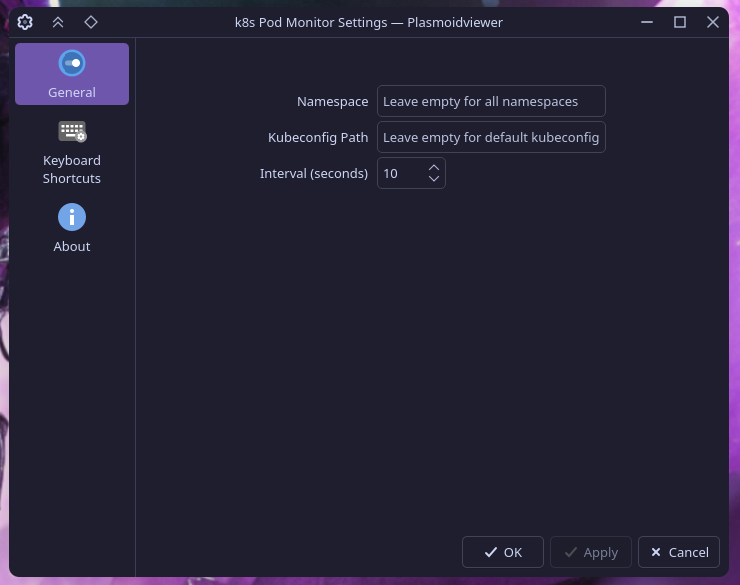

# Plasma K8s Pod Monitor

KDE Plasma 6 widget to monitor Kubernetes pod statuses.

[Click to see in store](https://store.kde.org/p/2357850)

## Requirements

- kubectl installed and in PATH
- Valid kubeconfig file

## Screenshot

